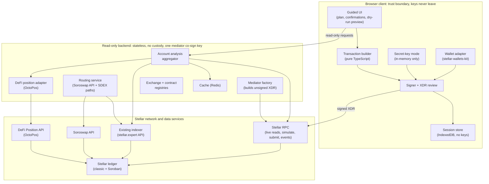
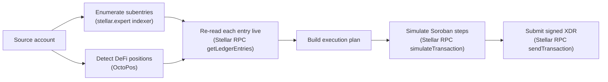
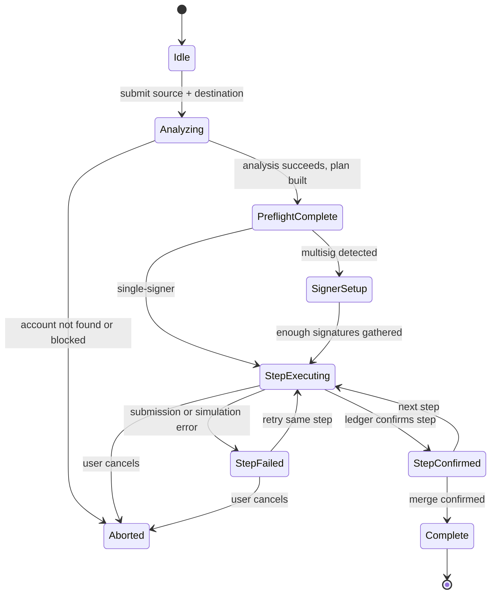
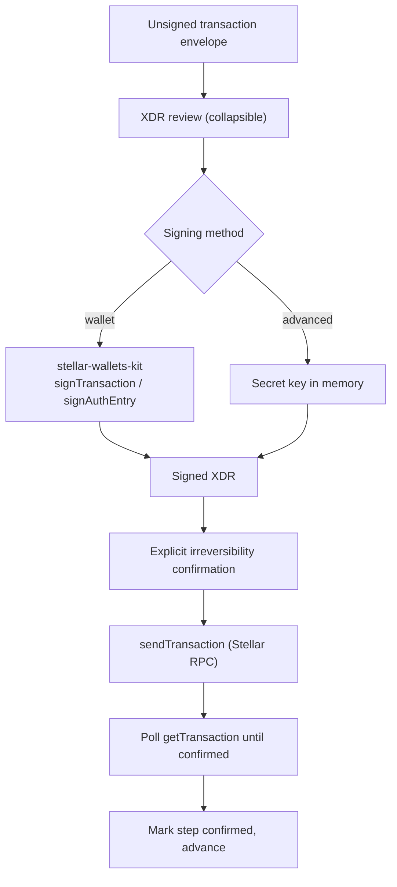
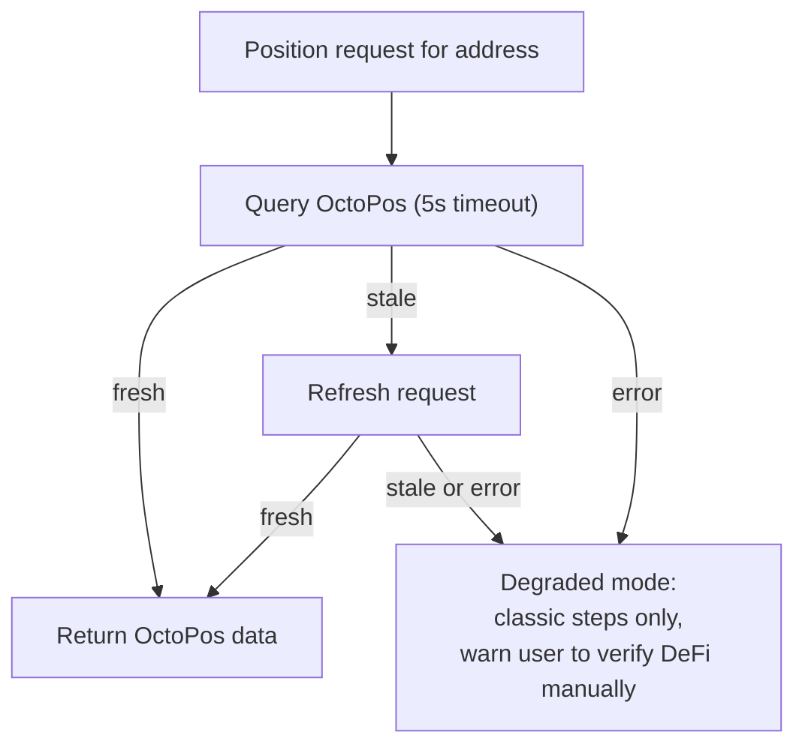
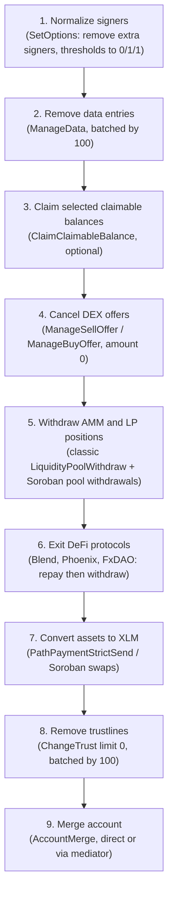
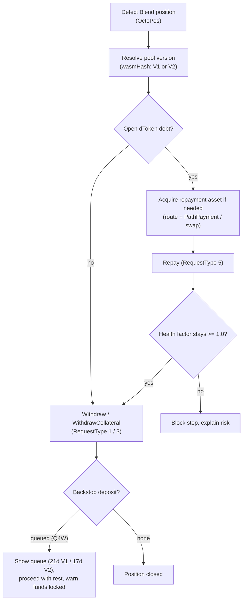
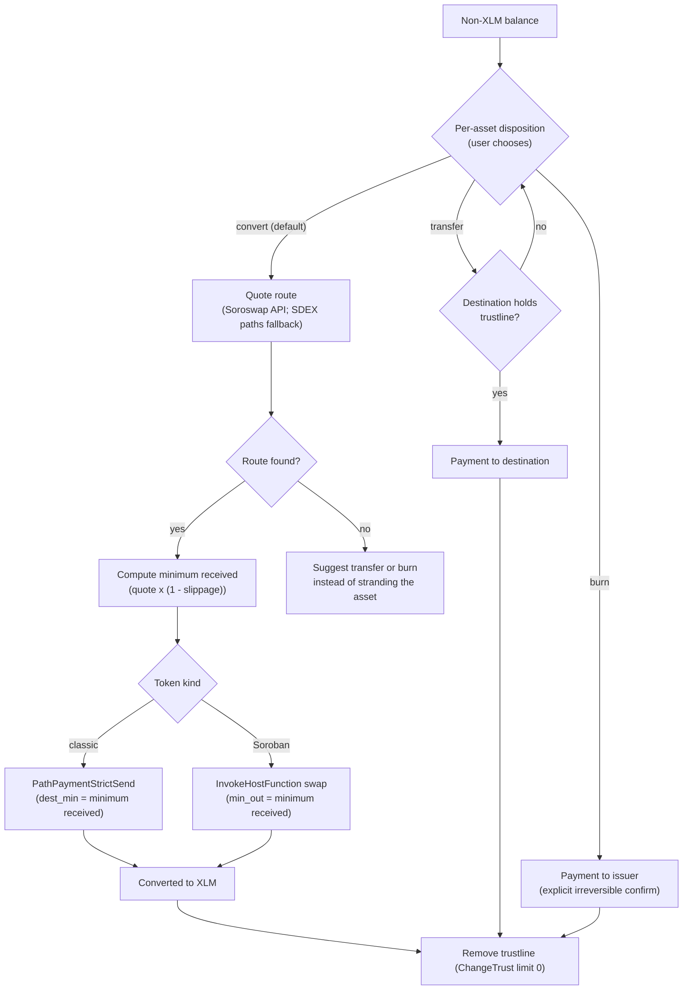

> Consolidated architecture for LumenWipe, an open-source tool that cleanly closes a Stellar account and recovers its locked reserves.
>
> Reference implementation extended by this project: [stellar.expert/demolisher/public](https://stellar.expert/demolisher/public) by Orbit Lens.

## Contents

1. [What this is](#1-what-this-is)
2. [The problem](#2-the-problem)
3. [How a Stellar account closes](#3-how-a-stellar-account-closes)
4. [System architecture](#4-system-architecture)
5. [Data sources, and why we run no indexer](#5-data-sources-and-why-we-run-no-indexer)
6. [Frontend architecture](#6-frontend-architecture)
7. [Read-only backend service](#7-read-only-backend-service)
8. [The execution plan](#8-the-execution-plan)
9. [Closing positions: classic and Soroban DeFi](#9-closing-positions-classic-and-soroban-defi)
10. [Asset conversion and routing](#10-asset-conversion-and-routing)
11. [The mediator account flow for exchanges](#11-the-mediator-account-flow-for-exchanges)
12. [Allowance inspection](#12-allowance-inspection)
13. [Security model](#13-security-model)
14. [Trust minimization, decentralization, and self-hosting](#14-trust-minimization-decentralization-and-self-hosting)
15. [Infrastructure and deployment](#15-infrastructure-and-deployment)
16. [User protection and privacy](#16-user-protection-and-privacy)
17. [Testing strategy](#17-testing-strategy)
18. [Maintenance after launch](#18-maintenance-after-launch)
19. [Delivery plan](#19-delivery-plan)
20. [Traction](#20-traction)
21. [Technology stack and standards](#21-technology-stack-and-standards)
22. [Failure modes and recovery](#22-failure-modes-and-recovery)
23. [Open questions and known risks](#23-open-questions-and-known-risks)
24. [Glossary](#24-glossary)
25. [References](#25-references)

Companion documents sit alongside this one:

- [Executive summary](/executive-summary): a one-page overview for a first read.
- [Community and communications](/community-and-communications): building in the open, update cadence, and decentralized social presence.

---

## 1. What this is

LumenWipe is a guided, non-custodial tool that walks a user through closing a Stellar account from start to finish. It removes everything that holds an account open, converts leftover assets to XLM, and merges the account into a destination address, returning the locked reserves to the user.

"Closing" a Stellar account is not a single operation. An account can only be merged once it holds no subentries apart from its signers and sponsors no other account. Getting there means unwinding whatever the account accumulated over its life: trustlines, open DEX offers, data entries, extra signers, liquidity pool shares, and positions in DeFi protocols such as Blend, Aquarius, Soroswap, Phoenix, and FxDAO. Each of those steps is its own transaction, with its own ordering constraints and its own failure modes.

The project extends the public-domain [stellar.expert/demolisher/public](https://stellar.expert/demolisher/public) tool built by Orbit Lens. That tool handles the classic case well: it cancels offers, sells assets on the SDEX, removes trustlines and data entries, works with multisig accounts, and can merge into exchange addresses through an intermediary account. It does not support Soroban, so any account with a Blend loan, an Aquarius LP position, or a Soroswap pair share cannot be closed with it today. This project keeps the parts that work, rebuilds them on the current Stellar stack, and adds full Soroban and DeFi parity, a read-only backend, an allowance inspector, and a production-grade UX designed for irreversible actions. Beyond the guided UI, two things widen who can use it: sponsored fees close accounts that hold only their locked reserves and cannot pay their own transaction fees (Section 8.1), and a REST API plus a TypeScript SDK let wallets and platforms drive the same wind-down programmatically (Section 7.3).

The tool signs every transaction in the browser; your account's secret keys never reach a server. The backend is read-only except for a single signing key, the shared exchange mediator, which it uses solely to co-sign the forwarding payment to an exchange (see section 11). It holds no user funds and no user keys.

Core stack at a glance:

| Layer          | Choice                                                          |
| -------------- | --------------------------------------------------------------- |
| Frontend       | Next.js, TypeScript, open source and self-hostable              |
| Stellar SDK    | `@stellar/stellar-sdk` (classic and Soroban)                    |
| Wallets        | stellar-wallets-kit (SEP-43), plus an in-memory secret-key mode |
| Network access | Stellar RPC: live reads, simulation, submission, events         |
| Enumeration    | stellar.expert API (existing indexer), pluggable                |
| Routing        | Soroswap API, with SDEX paths as fallback                       |
| DeFi detection | OctoPos DeFi Position API                                       |
| Backend        | Read-only Next.js API routes, stateless, Redis cache            |

## 2. The problem

Stellar has more than ten million accounts on mainnet, and a large share of them are stale, abandoned, or effectively locked. Two structural facts create the problem.

First, every account locks XLM in reserve. The base reserve is currently 0.5 XLM (a network-voted parameter). Since CAP-33, an account's minimum balance is `(2 + numSubEntries + numSponsoring - numSponsored) × base reserve`: two base reserves for the account itself, one per subentry it owns (each trustline, offer, data entry, and extra signer), plus one per entry it sponsors for others, minus one per entry of its own that someone else sponsors. A pool-share trustline counts as two base reserves. So an account with four trustlines, two offers, one data entry, and one extra signer locks `(2 + 8) * 0.5 = 5 XLM` that the user cannot spend until the entries are removed. Across millions of accounts, this is a meaningful amount of capital frozen in the ledger.

Second, closing an account cleanly is a manual, multi-step process that most users cannot perform. Any leftover entry causes the final `ACCOUNT_MERGE` to fail with `ACCOUNT_MERGE_HAS_SUB_ENTRIES`. A user has to know to cancel every offer, exit every DeFi position, sell every asset, remove every trustline, and clear every data entry, in a valid order, before the merge will succeed. Miss one and the merge reverts. (Extra signers are the one kind of subentry that does not block the merge: the protocol's check excludes them, and they are deleted with the account.)

Centralized exchanges make it worse. No major exchange supports `ACCOUNT_MERGE`. A user who wants to send their remaining XLM to an exchange cannot merge directly into a deposit address, so the final 1 XLM minimum balance stays frozen on the ledger. The reference demolisher solves this with an intermediary account, and this project keeps that approach.

Three groups of users feel this most: individuals consolidating or abandoning wallets, exchanges that need to help users recover funds, and DeFi users with open positions across Stellar protocols. The last group has no tool today, because the existing demolisher has no Soroban support.

## 3. How a Stellar account closes

`ACCOUNT_MERGE` transfers the entire XLM balance of the source account to a destination and deletes the source account from the ledger. The protocol enforces strict preconditions. The pre-flight analysis in this tool exists to detect and clear every one of them before it builds a merge transaction.

The merge fails with one of these result codes if a precondition is unmet:

| Result code                     | Cause                                                                                                       | How the tool resolves it                                                               |
| ------------------------------- | ----------------------------------------------------------------------------------------------------------- | -------------------------------------------------------------------------------------- |
| `ACCOUNT_MERGE_HAS_SUB_ENTRIES` | Source still has trustlines, offers, or data entries (signers are excluded from this check by the protocol) | Remove every blocking subentry in earlier steps before the merge                       |
| `ACCOUNT_MERGE_IS_SPONSOR`      | Source sponsors reserves for another account                                                                | Detect in pre-flight, block the merge, explain that sponsorships must be revoked first |
| `ACCOUNT_MERGE_IMMUTABLE_SET`   | Source has the `AUTH_IMMUTABLE` flag set                                                                    | Detect in pre-flight, block with a clear explanation (the account cannot be merged)    |
| `ACCOUNT_MERGE_SEQNUM_TOO_FAR`  | Source sequence number is above the current ledger bound                                                    | Surface the condition; rarely hit in practice                                          |
| `ACCOUNT_MERGE_NO_ACCOUNT`      | Destination does not exist                                                                                  | Verify the destination on the ledger before submitting                                 |
| `ACCOUNT_MERGE_DEST_FULL`       | Destination balance would overflow the int64 maximum, accounting for its XLM buying liabilities             | Surface as a blocker                                                                   |
| `ACCOUNT_MERGE_MALFORMED`       | Source equals destination, or otherwise malformed                                                           | Validation rejects this at input time                                                  |

The pre-flight checks map directly onto these codes. Sponsorship detection prevents `ACCOUNT_MERGE_IS_SPONSOR`. Subentry enumeration and removal prevent `ACCOUNT_MERGE_HAS_SUB_ENTRIES`. Destination verification prevents `ACCOUNT_MERGE_NO_ACCOUNT`. The tool never submits a merge it expects to fail.

Note that being a _claimant_ of a claimable balance does not block the merge, but _sponsoring_ one does, because the sponsor carries its reserve (one base reserve per claimant, not per balance). An account that created claimable balances is their sponsor unless the sponsorship was later transferred, so those must be resolved first.

## 4. System architecture

The system has three layers: a browser client that builds and signs every transaction, a thin read-only backend that aggregates data (and co-signs one thing, the exchange forwarding payment), and the Stellar network plus the external data services the backend reads from. The trust boundary is the browser. A user's account keys and signing live entirely on the client side. The backend's only key is the shared mediator, which can co-sign the exchange forwarding payment but cannot sign for a user's account, change a destination, or move a user's funds.



Two things to read off this diagram. The signed-XDR arrow runs from the client directly to Stellar RPC; submission is always client-side. The backend is not in the signing path for a user's account - its only signature is the shared mediator's co-signature on the exchange forwarding payment (section 11). And every external read source is pluggable: RPC, the indexer, the routing API, and the DeFi position API can each be swapped or pointed at a self-hosted instance without touching the transaction logic.

## 5. Data sources, and why we run no indexer

Building LumenWipe requires reading account state, and that state lives in two places the same way the network splits its tooling: classic ledger state, and live or Soroban state.

A practical constraint shapes the whole data design. Stellar RPC's `getLedgerEntries` can only return entries whose keys you already know. You pass it serialized `LedgerKey` values (up to 200 per request) and it returns those exact entries. It has no scan, filter, or "list all trustlines for this account" capability. To build a trustline `LedgerKey` you already need the asset; to read an offer you already need the offer ID. RPC alone therefore cannot tell you what an unknown account holds.

Enumerating an account's subentries (every trustline, offer, data entry, claimable balance, pool share, signer, and sponsorship relationship) requires an indexer. The project takes a clear position here: we do not build or operate an indexer, and we do not depend on SDF-hosted Horizon. SDF reduced its hosted Horizon to one year of history in August 2024 and steers integrators toward Stellar RPC plus ecosystem data services. Running a bespoke indexer (Captive Core, Galexie, a database) is not the problem this project exists to solve, and it would be operational weight with no payoff for the tool.

Instead the tool reads from existing, production-grade sources through pluggable adapters:

| Concern                                                                                   | Source                                                                                                                              | Why                                                                                                                                                                     |
| ----------------------------------------------------------------------------------------- | ----------------------------------------------------------------------------------------------------------------------------------- | ----------------------------------------------------------------------------------------------------------------------------------------------------------------------- |
| Enumerate trustlines, pool shares, claimable balances, signers, sponsorships              | stellar.expert API (existing indexer; primary)                                                                                      | RPC cannot enumerate. stellar.expert already indexes this and is the data layer behind the reference demolisher.                                                        |
| Enumerate open DEX offers and data entries                                                | A Horizon-compatible current-state endpoint (Blockdaemon, QuickNode, Validation Cloud, and similar), via the same adapter interface | stellar.expert exposes no offer or data-entry listing. These are current-state queries, unaffected by any provider's history truncation, and the provider is pluggable. |
| Alternate enumeration for self-hosting                                                    | Any Horizon-compatible provider or Stellar-native indexer (Mercury, SubQuery, and similar)                                          | Lets an operator who self-hosts avoid any single read dependency.                                                                                                       |
| Live ledger-entry reads for known keys, right before building each transaction            | Stellar RPC `getLedgerEntries`                                                                                                      | Authoritative current state. Builds exact transaction parameters and avoids acting on stale data.                                                                       |
| Soroban simulation (footprint, authorization, resource fees)                              | Stellar RPC `simulateTransaction`                                                                                                   | Required for every `InvokeHostFunction` operation.                                                                                                                      |
| Transaction submission and confirmation                                                   | Stellar RPC `sendTransaction`, `getTransaction`                                                                                     | Client submits and polls directly.                                                                                                                                      |
| Contract events (for example, discovering `approve` spenders for the allowance inspector) | Stellar RPC `getEvents`, with the indexer for older windows                                                                         | RPC retains a bounded event window.                                                                                                                                     |
| DeFi position detection across protocols                                                  | OctoPos DeFi Position API                                                                                                           | Builds on a funded DeFi Position API instead of reinventing protocol indexing.                                                                                          |
| Swap routing and swap-XDR construction                                                    | Soroswap API (primary), stellar.expert paths (classic SDEX fallback)                                                                | Best-available routes across Soroban and classic venues without a Horizon dependency.                                                                                   |
| Exchange and anchor registry (mediator and memo rules)                                    | Static JSON sourced from the stellar.expert directory                                                                               | Determines which destinations need the mediator flow and a memo.                                                                                                        |

The split is deliberate. An indexer answers "what does this account hold". RPC answers "what is the exact current state of this specific entry, right now, and will this transaction succeed". The tool enumerates with the indexer, then re-reads each entry over RPC immediately before building the transaction that touches it, so it never signs a transaction based on stale enumeration data. As a completeness check, the enumeration result is reconciled against the account's `numSubEntries` counter from the live `AccountEntry`: if the counts disagree, the tool surfaces a blocker instead of building a plan that would miss an entry.

### Accounts of any age

Account age never limits this design, and that is worth stating precisely because Stellar RPC does have a retention window. The window (at most 7 days) applies only to history-shaped methods: `getTransactions`, `getTransaction`, and `getEvents`. It does not apply to `getLedgerEntries`, which reads the current ledger snapshot: a trustline created in 2015 and a trustline created yesterday are the same read. Closing an account needs no transaction history at all; it needs current state, which RPC serves for any account regardless of age, and enumeration, which the indexer serves from full history. The one age-correlated wrinkle is Soroban state archival: a long-dormant account's contract entries (a DeFi position, a token balance) may have expired to the archive, where a plain read no longer sees them. The tool detects archived entries and inserts a `RestoreFootprint` step before the exit that needs them (Section 22). Classic entries never archive.



### Data freshness and consistency

DeFi position data is a snapshot, and acting on a stale snapshot would build a wrong exit. The position API returns freshness metadata with every response: a staleness value in seconds, the last indexed ledger, and a partial-result flag when some protocols could not be read. The tool uses this directly. If position data is older than a short threshold it refreshes before building the plan, and it shows the ledger and staleness so the user knows how fresh the view is.

Consistency across the boundary between enumeration and execution is the harder problem. Enumeration says a trustline or position exists; the exact amount can move before the user signs. The tool's guarantee is the live re-read: every transaction is built from a fresh `getLedgerEntries` read of the specific entries it touches, taken immediately before construction, not from the enumeration snapshot, and Soroban exits are simulated against current state before signing. Enumeration decides what to do; a live read decides the exact parameters. That keeps the tool from acting on data that moved.

## 6. Frontend architecture

The frontend is a Next.js application in TypeScript. It owns all transaction construction, signing, and submission. It holds the entire flow as an explicit state machine so a user can leave and resume without losing progress, which matters because a full wind-down is several sequential transactions, not one.

### 6.1 State machine



Each transition is written to a local session store in IndexedDB. The store holds the source and destination addresses, the network, the ordered plan, which steps have confirmed and their transaction hashes, and the shared mediator public key when an exchange destination is in use. It never holds secret keys or fully-signed envelopes beyond the step currently in flight. On re-entry the tool re-runs the analysis and reconciles against on-chain state, so a step that already confirmed (or was completed externally) is skipped rather than repeated.

### 6.2 Transaction builder

The builder is a pure module: account state in, an ordered list of unsigned transaction envelopes out. It has no network side effects, which makes it directly unit-testable. Each envelope carries its step index, a human-readable description, an estimated fee, and its dependencies (the steps that must confirm first). For classic steps it builds operations directly with the Stellar SDK. For Soroban steps it assembles `InvokeHostFunction` operations and defers footprint, authorization, and resource fee to RPC simulation. The builder enforces the 100-operations-per-transaction protocol limit and splits oversized steps into batches.

### 6.3 Wallet integration and signing

Signing has two paths. The primary path is [stellar-wallets-kit](https://github.com/Creit-Tech/Stellar-Wallets-Kit), which gives a unified interface across Freighter, xBull, Albedo, LOBSTR, Rabet, Hana, WalletConnect, and others. The application passes an unsigned XDR and receives a signed XDR through `signTransaction`; the underlying private key never enters the application. For Soroban operations the kit also exposes `signAuthEntry`, though wallet support varies (Freighter, Hana, WalletConnect, and Ledger implement it; several others do not), so the tool builds its Soroban exits with source-account authorization, which the plain `signTransaction` path covers on every wallet, and reserves `signAuthEntry` for the cases that genuinely need a separate auth entry. The secondary path is an advanced secret-key mode for users whose keys are not in any wallet. In that mode the key lives only in memory, never in any persisted storage, and is cleared after each signing operation. Section 13 details the handling.



For multisig accounts the kit and secret-key paths both support accumulating signatures: the tool collects signatures from several keypairs or wallets in sequence on the same envelope until the account thresholds are met, then submits. Each individual key is cleared from memory immediately after its signature is applied.

## 7. Read-only backend service

The backend is a stateless, read-only API layer whose main job is to aggregate read data the client cannot efficiently fetch itself, and to cache it. It runs as the API routes of the same Next.js service rather than a separate microservice, which keeps deployment to one open-source application. It accepts no user keys, holds no user funds, and builds no signed transactions for a user's account. Its one exception is the shared mediator key: it co-signs the exchange forwarding payment only after validating the transaction shape (operation one merges into the mediator, operation two is a payment from the mediator of at least 1 XLM), and it cannot change that payment's destination or amount. If it were fully compromised it could return wrong read data (caught by confirmations and on-chain simulation) or refuse to co-sign, but it could never sign for or move a user's account.

It exposes a small read-only REST surface:

| Endpoint                              | Purpose                                                                                                                                                    |
| ------------------------------------- | ---------------------------------------------------------------------------------------------------------------------------------------------------------- |
| `GET /v1/account/:address/analysis`   | Full pre-flight analysis: balances, subentries, sponsorships, multisig, reserves, detected DeFi positions, claimable balances, and computed merge blockers |
| `GET /v1/account/:address/positions`  | Normalized DeFi positions, proxied and cached from OctoPos                                                                                                 |
| `GET /v1/routing/convert`             | Best conversion route for an asset pair and amount, with estimated and minimum receive amounts                                                             |
| `GET /v1/mediator/check/:destination` | Whether a destination needs the mediator flow and a memo, using the exchange registry and a ledger existence check                                         |
| `POST /v1/mediator/sign`              | Co-signs the atomic merge-and-forward transaction with the shared mediator key, after validating the exact transaction shape (Section 11)                  |
| `GET /v1/health`                      | Component status for indexer, RPC, and the DeFi position provider                                                                                          |

### 7.1 DeFi position adapter

The backend consumes OctoPos behind one adapter interface, so the rest of the system never sees provider-specific shapes. OctoPos is a funded DeFi Position API in the Stellar ecosystem, and the backend builds on it rather than reinventing protocol indexing. The adapter keeps the provider pluggable: a self-hoster can point it at a compatible provider, and if OctoPos is unavailable the tool enters a degraded mode: classic entries process normally, and the user is warned that DeFi positions could not be detected and must be checked manually.

OctoPos covers position detection across Blend, Aquarius, Soroswap, Phoenix, and FxDAO, plus native wallet balances, and reports claimable AQUA rewards and pending Phoenix rewards alongside the positions. It also exposes two pieces the tool leans on directly: for unsubscribed addresses it returns `queryKeys` (ready-made ledger keys plus pool and pair metadata) so positions can be read straight over RPC `getLedgerEntries` without OctoPos storing anything server-side, which fits this tool's live re-read invariant exactly. One boundary matters for planning: OctoPos serves mainnet only. On testnet the tool discovers DeFi positions through direct contract reads driven by the contract registry, which is the same code path the degraded mode uses, so the fallback stays exercised by every test run.

The provider returns a position payload, an enrichment dictionary (asset symbols, decimals, USD prices and their source, contract names and versions), and a meta block with freshness and confidence fields. The adapter maps these onto one normalized model so the transaction builder sees a single contract:

| Normalized field                                           | Source                         | Use                                                                                   |
| ---------------------------------------------------------- | ------------------------------ | ------------------------------------------------------------------------------------- |
| Positions per protocol (supply, borrow, LP, backstop, CDP) | Provider position payload      | Drives which exit steps the plan includes                                             |
| `data_staleness_seconds`, `last_indexed_ledger`            | Provider meta block            | Freshness gate before building the plan (Section 5)                                   |
| `partial_result`                                           | Provider meta block            | Marks protocols the provider could not read; those positions are flagged, not guessed |
| `attribution_confidence`                                   | Provider meta block            | Low confidence triggers a notice to verify positions on an explorer before proceeding |
| Asset and contract enrichment                              | Provider enrichment dictionary | Human-readable labels in the plan view, without extra lookups                         |

The adapter uses the authenticated tier where an API key is configured and the public tier otherwise. It sends only the address it was asked to analyze, and it caches only public position data.



### 7.2 Caching

Read data is cached with short TTLs, keyed by address: positions for tens of seconds, routing for a few seconds (routing is time sensitive), analysis for a few seconds with explicit refresh on user request. The cache holds public, read-only data. It holds no keys and no user identity.

### 7.3 Integration surfaces: UI, API, and SDK

The guided UI is one consumer of the system, not the system itself. Everything under it (analysis, plan generation, transaction construction) is exposed for programmatic use, because the audiences that close accounts at scale are not clicking through a wizard:

- **REST API**: the read-only endpoints in Section 7 plus plan and unsigned-XDR generation per step, so a platform can drive a wind-down from its own backend, sign with its own keys, and submit. Batch analysis takes a list of addresses and returns per-account plans, which is what an operator decommissioning a fleet of deposit or payout accounts actually needs; step status is polled, keeping the backend stateless.
- **TypeScript SDK**: the transaction builder is already a pure, self-contained module (account state in, unsigned envelopes out). Published as an npm package, it lets a wallet embed a "close account" flow inside its own UI and signer, with this web app serving as the reference implementation.

The design cost of this is near zero precisely because of the existing constraints: the builder is pure, the backend is stateless, and signing was never coupled to the UI. The audiences are concrete: wallets offering account closure as a feature, platforms with per-user Stellar accounts (payouts, remittances, embedded wallets) recovering sponsored reserves when users churn, and exchanges or anchors giving customers a clean off-boarding path.

## 8. The execution plan

From the analysis the tool generates a deterministic, ordered plan. Same account state, same plan. The order satisfies ledger constraints: you cannot withdraw collateral while a loan is open, you cannot remove a trustline while it holds a balance, and you cannot merge while any subentry remains.



A few details that matter for correctness:

- Signer normalization runs first when extra signers exist, so a single key can authorize every later step. It removes each extra signer with `SetOptions` weight 0 and sets the low, medium, and high thresholds to 0/1/1. This step is a usability and efficiency choice, not a merge precondition: the protocol's subentry check excludes signers, so an account could merge with them in place. Removing them early collapses a multisig flow to one key for the remaining transactions and turns each signer's 0.5 XLM reserve into spendable balance mid-flow, where it can cover fees.
- Steps with more than 100 operations split into batches of 100, the protocol limit per transaction.
- A step that turns out to be a no-op (no offers, no data entries) is skipped, not submitted.
- Soroban steps are one `InvokeHostFunction` per transaction, because each needs its own RPC simulation for footprint, authorization, and resource fee.
- The plan is recomputed on resume, so external changes between sessions are reconciled rather than blindly repeated.

Because a full wind-down is many sequential transactions, a single end-to-end dry run is not feasible. The tool's preview approach is two-tiered: a complete plan view up front (every step, its operations, its estimated fee, and the estimated final XLM that reaches the destination), and a per-step simulation immediately before each signature using `simulateTransaction` for Soroban steps and a build-and-validate check for classic steps. Any simulation failure is surfaced in plain language before the user is asked to sign, never after.

### 8.1 Sponsored fees: closing accounts that cannot pay their own way

The accounts that most need closing are often the ones that technically cannot start. An account sitting at exactly its minimum balance (the bare 1 XLM minimum, or more XLM locked entirely in subentry reserves) cannot pay even the 100-stroop base fee: the network rejects the transaction with `txINSUFFICIENT_BALANCE` because the fee would take the account below its reserve. Without help, these accounts are stuck holding their own reserves hostage.

The fix is the protocol's fee-bump transaction (CAP-15). The user builds and signs the inner transaction in the browser exactly as in every other step, with its inner fee set to zero. The backend wraps it in a fee-bump envelope whose fee source is a dedicated, lightly funded fee account, signs only the outer envelope, and submits. The semantics are exact: the fee account pays the entire fee, the inner source pays nothing, and the inner transaction's signature covers its contents, so the backend cannot alter an operation, an amount, or a destination without invalidating the user's signature. The fee account never touches user funds; the only thing it can spend is its own XLM, on fees.

Because this adds a funded key to an otherwise read-only backend, the surface is deliberately narrow, mirroring the mediator co-sign validation:

- The backend decodes the inner transaction and sponsors it only if every operation matches the wind-down shapes (`ChangeTrust` with limit 0, `ManageSellOffer`/`ManageBuyOffer` with amount 0, `ManageData` removals, `SetOptions` signer normalization, `ClaimClaimableBalance`, conversion payments, `AccountMerge` to the session destination).
- The outer fee is capped per transaction, requests are rate-limited per account and IP, and the fee account carries a small operational float with a daily spend cap and alerting. Replay is structurally impossible: the inner transaction consumes the source account's sequence number.

The reserves released by the wind-down repay the sponsorship many times over, so the feature funds itself at the account level. On infrastructure, the ecosystem context is precise and worth stating: SDF deprecated the Launchtube service in March 2026 and designates the OpenZeppelin Relayer as its successor. OpenZeppelin's hosted Channels service requires no infrastructure, but as of mid-2026 it accepts only transactions containing a single `invokeHostFunction` operation, so it can sponsor Soroban steps and nothing else; the fee-bump wrap for classic operations (which is most of a wind-down) exists only in the self-hosted relayer's sponsored-transactions mode. The tool therefore implements the classic fee-bump endpoint inside its own read-only API layer, which is small (build the envelope, validate, sign the outer layer, submit) and keeps the deployment a single service, and treats the self-hosted OpenZeppelin Relayer as the drop-in alternative for operators who prefer audited policy infrastructure, with the hosted Channels service usable for Soroban-only steps. Fee sponsorship covers transaction fees only; it is distinct from CAP-33 reserve sponsorship, which this flow does not need.

## 9. Closing positions: classic and Soroban DeFi

This is the part the existing reference tool cannot do, and the core of the technical work. Detection and unwinding are separated. OctoPos tells the tool _what_ positions exist across every supported protocol, along with the contract addresses and pool metadata behind them. The tool then constructs every _exit_ transaction itself, reading exact on-chain state over RPC and simulating before signing. It integrates each protocol through its published SDK, public API, or contract interface; it does not guess at contract shapes.

A versioned contract registry maps each pool or vault contract's `wasmHash` to a known protocol version. An unknown `wasmHash` flags that position for manual review rather than risking an exit transaction built against the wrong interface.

The protocols and their exit mechanics at a glance:

| Protocol    | Position type                               | Detection               | Exit mechanism                                                       | Integration                    |
| ----------- | ------------------------------------------- | ----------------------- | -------------------------------------------------------------------- | ------------------------------ |
| Classic DEX | Order-book offers                           | Indexer                 | `ManageSellOffer` / `ManageBuyOffer` with amount 0                   | Native operations              |
| Classic AMM | Pool-share trustline                        | Indexer                 | `LiquidityPoolWithdraw`, then `ChangeTrust` limit 0                  | Native operations              |
| Blend       | Supply (bToken), borrow (dToken), backstop  | Position API            | `Pool.submit` with Repay, Withdraw, WithdrawCollateral; backstop Q4W | `@blend-capital/blend-sdk`     |
| Aquarius    | AMM LP, AQUA rewards                        | Position API, contracts | `withdraw`, `claim`                                                  | Aquarius contracts and backend |
| Soroswap    | AMM LP                                      | Position API, factory   | Router `remove_liquidity`                                            | Soroswap API (builds XDR)      |
| Phoenix     | AMM LP, optional stake                      | Position API, contracts | `withdraw_liquidity`, `unbond` first if staked                       | Phoenix contracts              |
| FxDAO       | CDP vault (XLM collateral, stablecoin debt) | Position API, storage   | `pay_debt`, then withdraw collateral                                 | FxDAO vault contracts          |

Coverage is driven by what users actually hold, not by market share. By current activity, Blend is the largest lending market and Aquarius the largest AMM, FxDAO is an active CDP protocol, and Soroswap and Phoenix are smaller. The tool supports all of them because a user with a position in any of them needs to close it to merge. A position in a frozen, deprecated, or winding-down contract must stay exitable: closing a position is exactly the withdraw-and-repay path such a contract still allows, so the tool reads contract status, surfaces it to the user, and never hides a position because its protocol changed state. The user's funds are still there.

### 9.1 Classic DEX offers

Open offers are cancelled with `ManageSellOffer` or `ManageBuyOffer` carrying the existing offer ID and `amount = 0`, which deletes the offer and frees its 0.5 XLM reserve. Passive sell offers, created with `CreatePassiveSellOffer`, are cancelled the same way. Offers batch at up to 100 per transaction. No external integration is needed; offers are enumerated from the indexer.

### 9.2 Classic Stellar liquidity pools

Stellar's native AMM (CAP-38, protocol 18 and later) holds a user's stake as a pool-share trustline, which costs two base reserves. The only operation that reduces shares is `LiquidityPoolWithdraw`, which burns shares and returns both reserve assets. The unwind is two steps: `LiquidityPoolWithdraw` for the full share balance, then `ChangeTrust` with limit 0 to remove the pool-share trustline. A pool-share trustline cannot be removed while shares remain, so ordering is enforced.

### 9.3 Blend (lending and borrowing)

Blend positions are detected by OctoPos: supply held as bTokens, debt as dTokens, with per-position health factors. The tool builds the exit itself with the official [`@blend-capital/blend-sdk`](https://www.npmjs.com/package/@blend-capital/blend-sdk) through the `Pool.submit` entry point, which takes a list of typed requests, each a `{ request_type, address, amount }`. The relevant request types are `Repay` (5), `Withdraw` (1), and `WithdrawCollateral` (3); supplied and collateralized balances are tracked separately, so the exit uses the request type matching how each position is held. For withdrawals, passing an amount larger than the position clamps down to the actual balance, which the tool uses to fully exit without dust. Repay behaves differently: the pool pulls the full stated amount from the account and refunds any excess in the same transaction, so the tool caps the repay amount at what the account actually holds rather than padding it. (OctoPos ships a Transaction Builder that can construct Blend exits server-side, but its own documentation marks it experimental and unmaintained, so the tool does not depend on it.)



The order is enforced: repay all dToken debt first, then withdraw bToken supply, because the protocol rejects collateral withdrawal that would leave a position undercollateralized. When the account lacks the asset to repay, the tool routes and acquires it first (Section 10).

Two Blend details round out the exit. BLND emissions are not reported by OctoPos, so the tool reads unclaimed emissions through the Blend SDK and offers to claim them before the exit, which matters because users routinely forget accrued rewards. And Blend's backstop module uses a queue-for-withdrawal (Q4W) cooldown, 21 days on V1 and 17 days on V2 (the backstop token is the BLND:USDC 80/20 Comet LP share on both): if a backstop withdrawal is queued, the tool shows the remaining time for that pool version, proceeds with the rest of the wind-down, and warns that the backstop funds stay locked until the queue clears. Blend has V1 and V2 pools on mainnet, and the SDK ships both contract clients, so the tool resolves the pool version per position before building the exit.

### 9.4 Aquarius (AMM)

Aquarius is a Soroban AMM. LP positions are withdrawn by calling the pool's `withdraw(user, share_amount, min_amounts)`, which burns shares and returns the reserve assets, with a minimum-received tolerance to bound slippage. OctoPos reports claimable AQUA rewards alongside the LP position, the tool confirms the amount on-chain with `get_user_reward(user)`, and claims with `claim(user)` before withdrawal when the user opts in; claiming AQUA may require an AQUA trustline, which the tool adds and then resolves in the conversion step. Aquarius pools can have claiming admin-paused (`kill_claim`), in which case the tool surfaces the paused rewards as a notice instead of failing the exit. Pools and positions are discovered from the DeFi Position API and the Aquarius backend, with direct contract reads over RPC as the fallback.

### 9.5 Soroswap

Soroswap is a Soroban AMM with a public [Soroswap API](https://docs.soroswap.finance/soroswap-api) that returns routes and builds XDR. LP withdrawal calls the router's `remove_liquidity(token_a, token_b, liquidity, amount_a_min, amount_b_min, to, deadline)`. Pairs are enumerated through the factory (`all_pairs_length`, `all_pairs`, `get_pair`), though in practice the DeFi Position API already reports which pairs the account holds. Where the tool relies on the Soroswap API to assemble a transaction, it signs and submits the API-built XDR directly rather than re-simulating it, which sidesteps a known Soroban `simulateTransaction` edge case around restored archival entries.

### 9.6 Phoenix

Phoenix is a Soroban AMM. The pool contract exposes `withdraw_liquidity(recipient, share_amount, min_a, min_b, deadline, auto_unstake)`, where `deadline` is optional and `auto_unstake` takes an optional `AutoUnstakeInfo` (the stake's amount and timestamp) that makes the pool unbond before burning shares. Staking itself lives in a separate contract whose entry points are `bond` and `unbond`, and `unbond` requires the original stake's timestamp, so the tool enumerates individual stakes to exit a staked position. It withdraws the full share balance with a minimum-received bound, unbonding first (or via `auto_unstake`) where a position is staked.

### 9.7 FxDAO

FxDAO is a CDP protocol: a user locks XLM collateral in a vault and mints a stablecoin (USDx, EURx, or GBPx, one denomination per vault). Vaults open at a 115% collateral ratio and liquidate below the 110% minimum, both admin-configurable per denomination. Closing a vault means repaying the stablecoin debt and withdrawing the XLM collateral. The vault contract tracks vaults in a sorted linked list, so debt repayment through `pay_debt` requires passing the neighboring vault keys, and vaults are enumerated through `get_vaults`. When the account does not hold enough stablecoin to repay, the tool acquires it through routing first. If a vault is undercollateralized at close time, automatic closure is not safe (it would invite liquidation), so the tool surfaces a clear error and asks the user to manage that vault manually.

### 9.8 What a protocol exit looks like end to end

For every Soroban exit the shape is the same: detect the position from the DeFi Position API, resolve the contract version from the registry by `wasmHash`, read exact on-chain amounts over RPC `getLedgerEntries` with `ScVal` decoding, build the `InvokeHostFunction` operation, simulate it over RPC to fill in footprint, authorization, and resource fee, present the simulation result to the user, sign client-side, submit, and poll for confirmation. The same adapter pattern that keeps the position provider pluggable isolates each protocol's contract interface, so a protocol upgrade is a registry and adapter change, not a rewrite.

### 9.9 Exit adapter invariants

Because the operations are irreversible, every protocol exit adapter must satisfy the same invariants before its output is signed. These are the contract the adapters are held to, and what the test suite checks.

| Invariant                  | What it guarantees                                                                                                                                                                                                               |
| -------------------------- | -------------------------------------------------------------------------------------------------------------------------------------------------------------------------------------------------------------------------------- |
| Live re-read before build  | Exit amounts come from a fresh `getLedgerEntries` read taken immediately before construction, never from cached or enumerated data                                                                                               |
| Simulate before sign       | Every Soroban exit is simulated over RPC for footprint, authorization, and resource fee, and the result is shown before the user signs                                                                                           |
| Halt on unknown `wasmHash` | An unrecognized contract version flags the position for manual review and builds nothing, rather than encoding against the wrong interface                                                                                       |
| Clamp to balance           | Exit amounts are clamped to the actual position, so a full exit leaves no dust and never over-withdraws                                                                                                                          |
| Verify server-built XDR    | A transaction built by an external API (the Soroswap API) is decoded client-side and its contract, function, amounts, minimum-received, and destination are asserted against locally read state before the user is asked to sign |
| Minimum-received bound     | Every swap or LP withdrawal carries a minimum-received amount derived from a fresh quote and a slippage tolerance                                                                                                                |
| Repay before withdraw      | Debt is repaid before collateral is withdrawn, and the resulting health factor is checked to stay at or above 1.0                                                                                                                |
| No silent skips            | A position the tool cannot safely close (undercollateralized vault, unknown version, missing route) is surfaced as a blocker with an explanation, never quietly ignored                                                          |
| Deterministic plan         | The same account state produces the same ordered plan, which keeps the flow auditable and testable                                                                                                                               |

## 10. Asset conversion and routing

After positions are unwound, the account may hold several classic and Soroban tokens. Each non-XLM balance gets an explicit, per-asset disposition the user chooses in the plan view, because "convert everything" is the common case but not the only legitimate one:

- **Convert to XLM** (the default): swap through the best available route, then remove the trustline.
- **Transfer to the destination**: send the balance as-is. The tool checks on-chain that the destination holds a trustline for the asset (or accepts it via the Soroban token balance) before offering this option, so a transfer can never bounce.
- **Burn**: send the balance back to its issuer, which destroys it. This is the right call for spam tokens, worthless dust, and assets with no route, and the tool labels it clearly as irreversible.

Routing for the convert path has two engines. The primary is the Soroswap API, which finds optimal routes across Soroswap, Phoenix, Aquarius, and the classic SDEX, handles both classic and Soroban tokens, and builds the swap XDR. Like every server-built transaction, that XDR is decoded and verified client-side before signing (Section 9.9). The fallback for pure-classic assets is strict-send path finding from the indexer, executed with `PathPaymentStrictSend` across SDEX order books and classic liquidity pools (up to six hops). Either way the tool computes a minimum-received amount from the quoted output and a slippage tolerance, and passes it as the destination minimum so a sudden price move cannot fill the swap at a bad rate.



The user keeps control. A trustline is only removed once the protocol's full deletion preconditions hold: zero balance, zero buying liabilities (every open offer buying the asset cancelled, which the step order guarantees), and no pool-share trustline still referencing the asset (pool exits run earlier for the same reason). If a residual balance remains after conversion, the tool offers the same transfer and burn dispositions or lets the user lower slippage and retry, rather than silently failing the later merge.

## 11. The mediator account flow for exchanges

Exchanges do not support `ACCOUNT_MERGE`, and their crediting systems only recognize `Payment` operations with a memo, so a user cannot merge directly into a deposit address (a direct merge is typically lost). The tool bridges this with a single shared mediator account, the same pattern the reference demolisher uses, in one atomic transaction.

```mermaid
sequenceDiagram
    participant S as Source account (user)
    participant M as Shared mediator (operator-funded)
    participant D as Destination (exchange deposit)

    Note over S,D: One atomic transaction, two operations
    S->>M: op1 AccountMerge (source into mediator)
    M->>D: op2 Payment (mediator to exchange, with memo)
    Note over D: Exchange credits the user by address + memo
    Note over S,D: User signs op1; backend co-signs op2 - both apply or neither
```

The mediator is a single, persistent account that the operator funds once. Its ~1 XLM minimum balance is paid once and reused for every close, so the user recovers essentially all of their XLM, including the source account's freed reserves; only standard network fees apply. This is the key difference from a throwaway per-user intermediary, which would sacrifice ~1 XLM on every close.

The transaction is built, and its merge half signed, in the user's browser. The backend then co-signs only the mediator's forward payment, after validating the exact shape: operation one must be an account merge into the mediator, and operation two a payment from the mediator to the user's chosen destination of at least 1 XLM. Because it is one atomic transaction with a fixed destination and amount, the backend cannot change where the funds go or divert them; it can only co-sign or refuse. This mediator key is the single server-side signing key in the system (see the security model).

When the destination is a known exchange or anchor, the tool requires the correct memo and blocks submission without it, because funds sent to an exchange without a memo are typically lost. A registry of known exchange and anchor addresses, sourced from the stellar.expert directory, drives two decisions: whether a destination needs the mediator flow, and whether it requires a memo and of which type (text, id, or hash).

## 12. Allowance inspection

Independent of closing an account, the tool offers a read-only allowance inspector. This is a security utility: a user who has approved token spending to DeFi contracts can audit and revoke those approvals, which limits exposure if a protocol is later exploited.

Soroban tokens follow the [SEP-41](https://github.com/stellar/stellar-protocol/blob/master/ecosystem/sep-0041.md) interface, including `approve(from, spender, amount, expiration_ledger)` and `allowance(from, spender)`. There is no on-chain way to list every spender an account has approved, so the inspector discovers candidate spenders from `approve` events (RPC `getEvents`, with the indexer for older windows) and from the known DeFi contract registry, then reads `allowance(owner, spender)` for each. Non-zero allowances are shown with the token, the spender contract and its protocol name when recognized, the approved amount, and the expiration ledger. Revoking sets the allowance to zero with `approve(owner, spender, 0, ledger)`, one `InvokeHostFunction` per revocation, and requires no full wind-down.

## 13. Security model

The tool builds transactions that drain an account irreversibly, so its security model starts from the assumption that only the user's own machine should ever be able to sign.

### 13.1 What is at risk and who attacks it

| Asset               | Risk                          | Mitigation                                                                                     |
| ------------------- | ----------------------------- | ---------------------------------------------------------------------------------------------- |
| Private key         | Total account control         | Never transmitted; wallet path keeps it in the wallet; secret-key path keeps it in memory only |
| Signed transaction  | One-time execution of a step  | Built and submitted client-side; user reviews XDR and confirms before submission               |
| Destination address | Funds sent to the wrong place | Full-address display, ledger existence check, explicit verification before merge               |
| Memo                | Lost funds at an exchange     | Required and validated for known exchange and anchor destinations                              |

A compromised backend cannot move a user's funds: its only key is the shared mediator, which can co-sign only a payment whose destination and amount the user already fixed in an atomic transaction, so it can neither sign for a user's account nor redirect the forward payment. It could return wrong read data; the client defends against that with on-chain simulation and explicit user confirmation of every destructive step. A passive network observer sees only TLS-protected read traffic. An XSS attacker is constrained by a strict Content Security Policy with no inline scripts and no `unsafe-eval`. A supply-chain attacker is constrained by lockfile-pinned dependencies, audited in CI, with no dependency permitted that needs dynamic code execution.

### 13.2 Key handling

The wallet path is primary: through stellar-wallets-kit the private key never enters the application. The secret-key advanced mode is for keys not held in any wallet, and is constrained: the input is a password field, the key is held only in memory (never in `localStorage`, `sessionStorage`, IndexedDB, cookies, or any network request), it is cleared immediately after each signing operation, and the component holding it is unmounted when the user leaves the signing step. For multisig, keys are gathered one at a time, each cleared right after its signature is applied. The ephemeral mediator key is generated in the browser, used once, and nulled; only its public key is recorded for recovery and transparency.

### 13.3 Confirmation and irreversibility controls

Every destructive step requires an explicit acknowledgment that states what will happen, shows the affected entry or balance, and warns that it cannot be undone. The tool never auto-submits; the user triggers each submission. The merge gets its own full-screen confirmation with the destination shown in full, a ledger existence check, and memo validation for exchange destinations.

### 13.4 Security reviews

The codebase undergoes internal security reviews as part of our development process. External security audits will be conducted when possible.

## 14. Trust minimization, decentralization, and self-hosting

For a tool that closes accounts, decentralization is first a matter of custody and control, and second a matter of who can run it.

Custody and control. The tool is non-custodial by construction. A user's account signing is client-side and their keys never reach a server. The backend holds one signing key, the shared exchange mediator, used only to co-sign a forwarding payment the user has already authorized in an atomic transaction. No operator of any component, including the maintainers, can change a destination, move a user's account funds, or close their account without the user's own signature. The user authorizes every transaction.

Who can run it. The whole project is open source under a permissive license, and the code that builds and signs transactions runs in the user's browser where anyone can read it. The tool deploys as a single Next.js service, so anyone can run their own instance with Docker or any Node host. Every external read source is behind a pluggable adapter, so a self-hoster can point the tool at their own Stellar RPC node, their preferred indexer, and their preferred DeFi Position API instance. The canonical deployment is a convenience, not a requirement: nothing about the tool depends on a server only the maintainers can run.

Where centralization remains, and why. The remaining centralized pieces are all read-only data sources: RPC providers, the indexer, the routing API, and the DeFi Position API. None can affect custody. Each is pluggable and has multiple independent providers in the Stellar ecosystem, so no single one is a hard dependency. The DeFi Position API (OctoPos) is a deliberate dependency, kept behind an adapter with an explicit degraded mode, so even there an outage limits functionality rather than breaking the tool.

| Component                          | Ownership                            | Reach               | Notes                                                                                                                         |
| ---------------------------------- | ------------------------------------ | ------------------- | ----------------------------------------------------------------------------------------------------------------------------- |
| Application (UI and read-only API) | Open source, self-hostable           | Open                | One Next.js service, deployable with Docker or any Node host; no user keys, no custody (only the shared mediator co-sign key) |
| Transaction builder and signing    | Open source, runs client-side        | Open                | The security-critical code; signing never leaves the browser                                                                  |
| Contract and exchange registries   | Open source, community pull requests | Open                | Versioned JSON, updated by reviewed pull request                                                                              |
| Stellar RPC access                 | Pluggable provider                   | External, read-only | Ecosystem providers or a self-hosted node                                                                                     |
| Subentry enumeration               | Pluggable indexer                    | External, read-only | stellar.expert API or a Horizon-compatible provider                                                                           |
| Swap routing                       | Pluggable                            | External, read-only | Soroswap API or SDEX paths                                                                                                    |
| DeFi position detection            | Pluggable                            | External, read-only | OctoPos behind an adapter, with an explicit degraded mode                                                                     |

Nothing in the open rows can move funds. Everything in the external rows is read-only and replaceable.

## 15. Infrastructure and deployment

The tool runs on light, replaceable infrastructure, which follows from the non-custodial design.

- Application: a single Next.js service that serves the guided UI and the read-only API routes. It holds no per-user state and no user keys (only the shared mediator co-sign key, injected from the environment), so it scales horizontally behind a load balancer. A published Docker image lets anyone self-host it.
- Cache: a Redis instance holds short-lived public read data only.
- Stellar access: Stellar RPC through ecosystem providers, configurable per deployment, with the option to run a self-hosted RPC node.
- Data services: the stellar.expert API for enumeration and the Soroswap API for routing, both pluggable; the OctoPos DeFi Position API.

The project commits to using the current stable Stellar stack: the latest `@stellar/stellar-sdk`, Stellar RPC, stellar-wallets-kit, and the live network protocol (Protocol 26, Yardstick, on mainnet since May 2026). The contract registry and protocol adapters are versioned so the tool tracks protocol and DeFi upgrades without a rebuild of its core logic.

## 16. User protection and privacy

The tool protects users on two fronts: their funds and their privacy.

Funds. The irreversibility controls in Section 13 are the protection: explicit per-step confirmations, no auto-submission, destination verification, memo validation for exchanges, per-step simulation before signing, and a resume flow that reconciles against on-chain state so an interrupted wind-down never double-acts.

Privacy. The tool collects no personal information and requires no account. Secret keys never leave the browser and are never logged. The backend handles only public addresses, which it does not retain beyond cache TTLs, and it associates no identity with a request. Any product analytics are privacy-preserving and self-hosted (for example Plausible or Umami) with no personal data, no cross-site tracking, and IP anonymization; the default is to ship no third-party trackers at all, and the Content Security Policy blocks third-party scripts. Abuse protection on the read-only backend is rate limiting by IP, which needs no stored identity.

## 17. Testing strategy

Testing matters more than usual here because the operations are irreversible and touch real balances. The suite has four tiers, all run in CI, and automated tests never touch mainnet.

- Unit: pure logic with deterministic fixtures. Transaction construction, fee estimation, reserve and balance math, routing parameter derivation, state machine transitions, input validation, and batching. The transaction builder is the highest-coverage module.
- Integration: against Stellar testnet with accounts funded by Friendbot at the start of each run. Account analysis, signer removal, offer cancellation, trustline removal, asset conversion, the merge, and each DeFi protocol exit. DeFi detection in these tests runs through the direct contract-read path, since OctoPos serves mainnet only; that keeps the degraded-mode code under permanent test coverage.
- Adversarial and edge case: deliberately unusual or hostile account states. Sponsoring accounts, the 1000-subentry maximum, revoked trustlines, multisig with hash(x) and pre-auth signers, undercollateralized vaults, queued backstop withdrawals, high-slippage conversions, and network failures such as a confirmed transaction whose response is lost (detected on retry through `getTransaction` so the step is not resubmitted).
- End to end: Playwright drives a real browser against testnet through the full flow, including the multisig path, the mediator path for exchange destinations, session recovery, and the allowance inspector.

## 18. Maintenance after launch

The design isolates the parts most likely to change.

Protocols upgrade, and DeFi contracts get redeployed. The versioned contract registry maps `wasmHash` to protocol version, so a new protocol version is a registry update (a reviewed pull request), not a code change. An unknown `wasmHash` degrades gracefully: the affected position is flagged for manual review instead of risking a wrong exit. Each protocol and each data provider sits behind an adapter, so adding a protocol or swapping a provider is a contained change. Dependencies are pinned and audited in CI, with weekly update pull requests. The repository carries a security policy and a responsible-disclosure process. Maintenance commitments, the cadence of protocol-coverage review, and the community update rhythm are detailed in the [community and communications](/community-and-communications) document.

## 19. Delivery plan

The work is delivered in three cumulative tranches, each a working, independently verifiable artifact.

| Tranche                 | Focus                                                                                                                                                                                                                                                                      | Key acceptance criteria                                                                                                                                                                                                                                       |
| ----------------------- | -------------------------------------------------------------------------------------------------------------------------------------------------------------------------------------------------------------------------------------------------------------------------- | ------------------------------------------------------------------------------------------------------------------------------------------------------------------------------------------------------------------------------------------------------------- |
| 1. Classic MVP          | Full classic wind-down on testnet: signer normalization, data entries, offer cancellation, classic liquidity pool withdrawal, asset conversion via SDEX paths, trustline removal, merge, and the mediator flow. Wallet and secret-key signing, multisig, session recovery. | All classic steps execute correctly on testnet; multisig account closed with multiple keys; mediator flow works for exchange destinations; sessions resume from on-chain state; all errors render in plain language; transaction builder above 80% coverage.  |
| 2. Soroban and DeFi     | Full Soroban parity: DeFi position detection via OctoPos; Blend, Aquarius, Soroswap, Phoenix, and FxDAO exits; Soroban token conversion; the allowance inspector; per-step simulation. Sponsored fees for reserve-locked accounts (Section 8.1).                           | Each protocol's positions detected, unwound, and confirmed on testnet; degraded mode when the position provider is down; Soroban fee estimates within tolerance of submitted fees; an account holding only its minimum reserve closed end to end on testnet.  |
| 3. Production hardening | Security review and remediation; mainnet deployment; performance and load validation; final UX from user testing; complete public documentation. Public REST API (batch analysis, per-step XDR) and the TypeScript SDK package (Section 7.3).                              | Security review completed with findings addressed; mainnet deployment live; CSP verified with no `unsafe-eval`; analysis within performance targets; API and SDK documented with a working integration example; repository public under a permissive license. |

## 20. Traction

The classic wind-down already runs. The current codebase is a working Next.js application that, on both networks, reads account state over Stellar RPC and the stellar.expert API, builds and signs classic transactions client-side, and executes the full path: signer normalization, data entry removal, offer cancellation, asset conversion through SDEX path payments, trustline removal, and `AccountMerge`, including the mediator flow for exchange destinations with the correct memo handling. It carries an exchange registry, IndexedDB session recovery, unit tests over the plan builder and helpers, and Playwright end-to-end coverage. This is the foundation the Soroban and DeFi work builds on, and the evidence that the team is already executing rather than starting from a blank page.

## 21. Technology stack and standards

Plain-English summary of what the tool is built from and why.

- Frontend: Next.js and TypeScript, an open source and self-hostable web app, with TypeScript's type safety valuable when constructing transactions.
- Stellar SDK: `@stellar/stellar-sdk`, the official SDK, which covers classic and Soroban.
- Wallets: stellar-wallets-kit, for one interface across Freighter, xBull, Albedo, LOBSTR, Rabet, Hana, WalletConnect, and more, including Soroban authorization-entry signing.
- Network access: Stellar RPC for live reads, simulation, submission, and events; the stellar.expert API for subentry enumeration; the Soroswap API for routing; OctoPos for DeFi position detection.
- DeFi integration: the official Blend SDK, the Soroswap API, and the published contract interfaces for Aquarius, Phoenix, and FxDAO, behind per-protocol adapters and a versioned contract registry.
- State and storage: Zustand for the wizard state machine, IndexedDB for resumable sessions (never keys).
- Backend: read-only API routes within the same Next.js service, stateless, with a Redis cache for short-lived public read data.
- Testing: the Bun test runner for units, Playwright for end-to-end on testnet.

### Standards we build on

The tool tracks the current stable protocol (Protocol 26, Yardstick, on mainnet since May 2026) and the latest `@stellar/stellar-sdk`. It builds on these ecosystem standards:

| Standard                          | What it is                                          | How the tool uses it                                                                                                                                                 |
| --------------------------------- | --------------------------------------------------- | -------------------------------------------------------------------------------------------------------------------------------------------------------------------- |
| SEP-41                            | Soroban token interface                             | Reads `balance` and `allowance`, revokes with `approve(owner, spender, 0, ledger)` for the allowance inspector, and handles Soroban token balances during conversion |
| SEP-43                            | Wallet interface implemented by stellar-wallets-kit | `signTransaction` across ecosystem wallets with no per-wallet code; `signAuthEntry` where the wallet implements it                                                   |
| CAP-38                            | Classic liquidity pools (protocol 18)               | `LiquidityPoolWithdraw` and pool-share trustline removal                                                                                                             |
| SEP-40                            | Oracle consumer interface                           | Reading a Blend pool's oracle price when validating that a partial repay keeps the health factor at or above 1.0                                                     |
| Stellar Asset Contract (CAP-46-6) | Classic assets usable inside Soroban                | Bridging classic balances and contract balances when converting Soroban-side                                                                                         |

## 22. Failure modes and recovery

The tool never leaves the user guessing. Every failure is either retryable with a clear path or surfaced as a blocker with a manual resolution, and partial progress is always recoverable from on-chain state.

| Failure                                               | What the tool does                                                                                                                     |
| ----------------------------------------------------- | -------------------------------------------------------------------------------------------------------------------------------------- |
| RPC unavailable                                       | Reads pause and retry with exponential backoff; the user sees a clear status and a retry, and no state changes                         |
| Indexer or position API unavailable                   | The classic flow proceeds; DeFi detection enters degraded mode with a warning to verify positions manually                             |
| Partial position data                                 | Affected positions are flagged; the tool builds no exit from incomplete data                                                           |
| Step fails on submission                              | The step is marked failed with a plain-language reason; the user retries the same step; later steps stay locked                        |
| Confirmation response lost                            | On retry the tool checks `getTransaction`; if the transaction already confirmed, the step is marked complete rather than resubmitted   |
| Sequence or fee issue                                 | The tool rebuilds with the current sequence number and a higher fee within the disclosed tolerance, then re-presents for signing       |
| Browser closed mid-flow                               | The session restores from IndexedDB and reconciles against on-chain state; completed steps are skipped                                 |
| Soroban entry archived                                | A long-dormant account may have archived contract entries; the tool detects this and inserts a `RestoreFootprint` step before the exit |
| Undercollateralized vault or unknown contract version | Surfaced as a blocker with an explanation; independent steps in the plan can still proceed                                             |

## 23. Open questions and known risks

These are the items the team is actively resolving. Listing them is deliberate: a tool that drains accounts should be honest about what is still being pinned down.

| Area                             | Open question or risk                                                                                                                                                                                                                                                          |
| -------------------------------- | ------------------------------------------------------------------------------------------------------------------------------------------------------------------------------------------------------------------------------------------------------------------------------ |
| FxDAO exit                       | Confirm the exact collateral-withdrawal entrypoint and the linked-list neighbor-key handling for `pay_debt` against the current contracts, and the full set of supported stablecoin denominations                                                                              |
| Soroswap simulation              | Confirm the precise `simulateTransaction` edge case and the raw JSON-RPC submission pattern against the current Soroswap API and protocol version                                                                                                                              |
| DeFi Position API specs          | Pin the exact OctoPos fields the adapter maps and coordinate with the OctoPos team; the documented API host and the live deployment currently diverge (endpoint paths and response surface), so the adapter pins against the live contract and treats the docs as aspirational |
| Offer and data-entry enumeration | stellar.expert exposes no listing for open offers or data entries; select and pin the Horizon-compatible current-state provider for those two queries, with `numSubEntries` reconciliation as the completeness check                                                           |
| Multisig signer types            | hash(x) and pre-auth transaction signers cannot be signed automatically; define the manual pre-image and pre-auth paths. The fourth signer type, ed25519 signed payload (CAP-40), must also be enumerated and removed                                                          |
| Dry-run depth                    | A full end-to-end simulation across many sequential transactions is not feasible; user testing must confirm that per-step simulation plus the plan view is enough                                                                                                              |
| Soroban state archival           | Archived ledger entries on dormant accounts may need a `RestoreFootprint` operation before an exit; confirm the handling end to end                                                                                                                                            |
| Coverage drift                   | Protocols change market share and contract versions; the registry and adapters track this, and coverage priorities are reviewed against on-chain activity                                                                                                                      |

## 24. Glossary

- Base reserve: the unit of locked XLM, currently 0.5 XLM (network-voted). An account's minimum balance is two base reserves plus one per subentry, adjusted by sponsorship (`+ numSponsoring - numSponsored`).
- Subentry: a trustline, offer, data entry, or signer attached to an account. Each adds one base reserve to the minimum balance; a pool-share trustline adds two.
- `ACCOUNT_MERGE`: the operation that transfers an account's full XLM balance to a destination and deletes the source account. Requires no subentries apart from signers, and no sponsorships.
- Sponsorship: an arrangement where one account pays the reserve for another account's entry. A sponsoring account cannot be merged until it stops sponsoring.
- Trustline: an account's declared ability to hold a given asset, with a balance and a limit. Removed with `ChangeTrust` set to limit 0 once the balance is zero.
- Stellar RPC: the JSON-RPC interface for live ledger reads (`getLedgerEntries`), Soroban simulation (`simulateTransaction`), submission (`sendTransaction`), confirmation (`getTransaction`), and events (`getEvents`). It cannot enumerate an account's unknown subentries.
- Indexer: a service that indexes ledger history and exposes enumeration, such as the stellar.expert API or a Horizon-compatible provider. The tool reads enumeration from an existing indexer rather than running its own.
- `InvokeHostFunction`: the Stellar operation that calls a Soroban smart contract. Each one is simulated over RPC to determine its footprint, authorization, and resource fee.
- `ScVal`: the value encoding used by Soroban contracts. The tool decodes `ScVal` results when reading on-chain position state.
- `wasmHash`: the hash identifying a deployed contract's code. The tool maps it to a known protocol version to pick the correct exit interface.
- bToken / dToken: Blend's representations of a supply position (bToken) and a debt position (dToken).
- Q4W: Blend's queue-for-withdrawal cooldown on backstop deposits: 21 days on V1 pools, 17 days on V2.
- CDP: a collateralized debt position, the FxDAO model where XLM collateral backs minted stablecoin.
- SAC: the Stellar Asset Contract, which lets a classic asset (and XLM) be used inside Soroban contracts. It implements the SEP-41 token interface.
- Mediator account: a temporary account used to forward funds to a destination that does not support `ACCOUNT_MERGE`, such as an exchange.

## 25. References

- Reference tool, stellar.expert demolisher (Orbit Lens): https://stellar.expert/demolisher/public
- StellarExpert demolisher announcement: https://medium.com/@orbit.lens/stellarexpert-embeddable-blocks-accounts-demolisher-and-other-new-features-931ec41427a1
- Stellar RPC overview and methods: https://developers.stellar.org/docs/data/apis/rpc
- getLedgerEntries reference: https://developers.stellar.org/docs/data/apis/rpc/api-reference/methods/getLedgerEntries
- SDF Horizon retention change (August 2024): https://stellar.org/blog/foundation-news/sdf-s-horizon-limiting-data-to-1-year
- List of operations (ManageSellOffer, ChangeTrust, AccountMerge, SetOptions, PathPaymentStrictSend): https://developers.stellar.org/docs/learn/fundamentals/transactions/list-of-operations
- Minimum balance and base reserve: https://developers.stellar.org/docs/learn/fundamentals/lumens
- Classic liquidity pools (CAP-38): https://developers.stellar.org/docs/learn/fundamentals/liquidity-on-stellar-sdex-liquidity-pools
- Path payments (strict send and receive): https://developers.stellar.org/docs/build/guides/transactions/path-payments
- Blend SDK: https://www.npmjs.com/package/@blend-capital/blend-sdk and https://docs.blend.capital/tech-docs/integrations/integrate-pool
- Blend backstop and Q4W: https://docs.blend.capital/users/backstopping
- Aquarius Soroban functions: https://docs.aqua.network/developers/aquarius-soroban-functions
- Soroswap API: https://docs.soroswap.finance/soroswap-api
- Phoenix contracts: https://github.com/Phoenix-Protocol-Group/phoenix-contracts
- FxDAO vaults: https://fxdao.io/docs/developers/vaults/overview/
- stellar-wallets-kit: https://github.com/Creit-Tech/Stellar-Wallets-Kit
- Stellar Asset Contract: https://developers.stellar.org/docs/tokens/stellar-asset-contract
- SEP-41 token interface: https://github.com/stellar/stellar-protocol/blob/master/ecosystem/sep-0041.md
- OctoPos: https://communityfund.stellar.org/project/octopos-defi-position-api-g6i and https://docs.crediolabs.ai/docs/category/octopos
