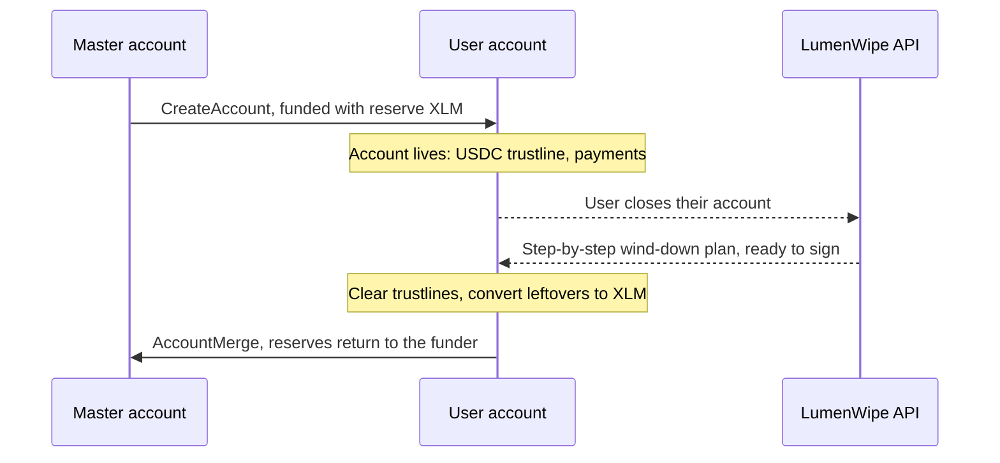

Platforms that create a Stellar account per user (embedded wallets, fintech apps, remittance and payout products) front the cost of every account they activate. A master account funds each new user account with enough XLM to exist: the 1 XLM minimum balance, plus 0.5 XLM for each trustline the product needs, a USDC trustline being the typical first one. That XLM is working capital, and it stays locked for the life of the account.

The problem shows up with churn. When a user leaves, their account keeps holding the platform's XLM unless someone winds it down properly, and "properly" means the full sequence: remove trustlines (after clearing any balance), remove data entries, cancel offers, then merge. At fleet scale this is not a manual job. A platform with 100,000 activated accounts and one trustline each has 150,000 XLM committed to reserves; every percentage point of churn that goes unrecovered strands 1,500 XLM permanently.

LumenWipe closes that loop. The REST API takes the departing account and returns the full wind-down plan ready to sign; the platform signs with its own key infrastructure, as it does for everything else. The merge destination is the master account that funded the account in the first place, so the activation capital returns to the same pool it came from and funds the next signup.

Only the platform's keys can move anything; LumenWipe never holds funds or keys. And every plan is checked against live on-chain state before execution, so an account the user already emptied or changed is handled correctly instead of blindly replayed.

## Partnership: Pollar

[Pollar](https://pollar.xyz/) is an SDK for onboarding users and enabling payments on Stellar: one integration that creates wallets, activates accounts, sets up USDC trustlines, and sponsors fees so end users never touch crypto mechanics. It is also our first integration partner.

Pollar's funding model is the one described above: a master account activates each user account with XLM. Through this partnership, Pollar is integrating LumenWipe into its account closure path, so that when a user closes their Pollar-powered account, the wind-down runs automatically and the recovered XLM merges back to the master account that originally funded it. For Pollar this turns activation from a sunk cost into a revolving one; for the user, closing an account becomes a single action instead of an impossible checklist.
